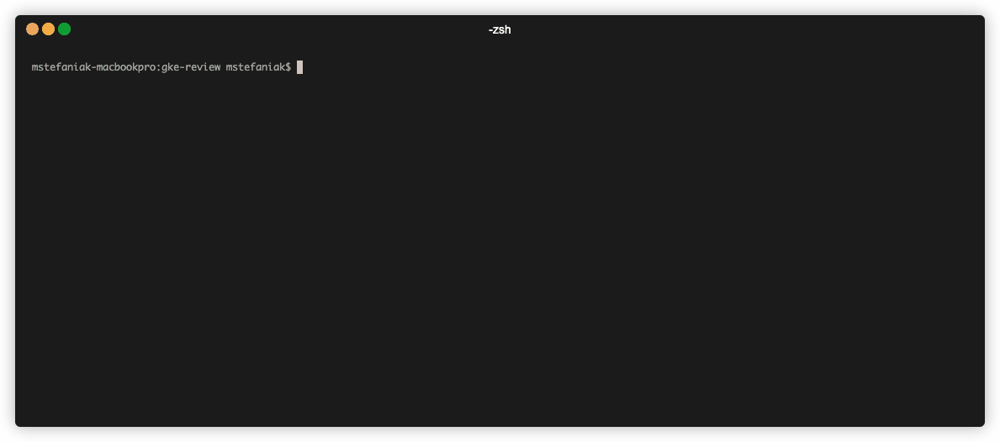

# Google Kubernetes Cluster review tool

[](https://goreportcard.com/report/github.com/google/gke-policy-automation)




This is not an officially supported Google product.

This tool validates selected [GKE](https://cloud.google.com/kubernetes-engine) cluster
against set of [REGO policies](https://www.openpolicyagent.org/docs/latest/policy-language/).
Policies are based mainly on official Google [documentation](https://cloud.google.com/kubernetes-engine/docs/best-practices).

## Table of Contents
- [Install](#install)
- [Usage](#usage)
- [Test](#test)
- [Contributing](#contributing)
- [License](#license)

## Install

```
make
```
or 
```
make build
```

## Usage

Tool can be used from command line with [gcloud CLI](https://cloud.google.com/sdk/docs/install) installed.
CLI can be previously authenticated with `gcloud auth application-default login` command, or credentials may be passed with `--creds` parameter.

Parameters for GKE cluster review can be provided as command parameters or via configuration .yaml file.

```
gke-policy-automation [global options] command [command options] [arguments...]
```

For cluster review with manually provided parameters:
```
./gke-policy-automation cluster review -p <GCP_PROJECT_ID> -n <CLUSTER_NAME> -l <CLUSTER_LOCATION>
```
and with .yaml file with format:
```yaml
silent: true
credentialsFile: ./test_credentials.json
clusters:
  - name: my-cluster
    project: my-project
    location: europe-central2
  - name: another
    project: my-project
    location: europe-central2
policies:
  - local: /tmp
outputs:
  - file: /some/file.json
```

Custom policies can be provided via local directory or remote Github repository. 
Example for local directory: 
```
./gke-policy-automation cluster review -p my_project -n my_cluster -l europe-central2-a  --local-policy-dir ./gke-policies/policy
```
and for Github repository:
```
./gke-policy-automation cluster review -p my_project -n my_cluster -l europe-central2-a  --git-policy-repo "https://github.com/google/gke-policy-automation" --git-policy-branch main --git-policy-dir gka-policies/policy

```

## Test

Testing policy files with [OPA Policy testing framework](https://www.openpolicyagent.org/docs/latest/policy-testing/)
```
opa test <POLICY_DIR>
```
for project policy folder:
```
opa test gke-policies
```

## Contributing

Please check out [Contributing](./CONTRIBUTING.md) and [Code of Conduct](./docs/code-of-conduct.md) docs before contributing.
See also [README for policies](./gke-policies/README.md)

## License
[Apache License 2.0](LICENSE)

---
