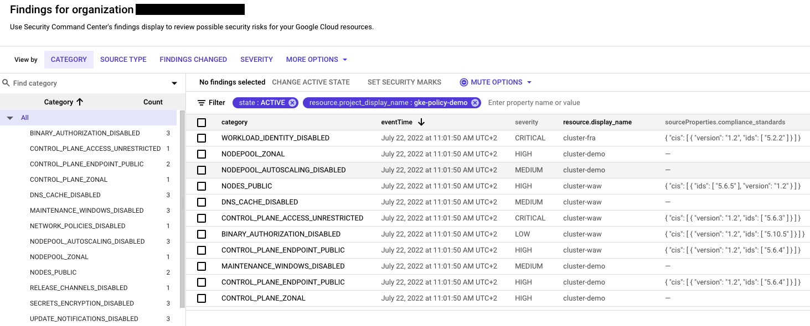

# GKE Policy Automation User Guide

The GKE Policy Automation is a command line tool that validates GKE clusters against set of best practices
and scalability limits.

---

## Table of Contents

* [Installation](#installation)
  * [Container image](#container-image)
  * [Binary](#binary)
  * [Source code](#source-code)
  * [kube-state-metrics](#kube-state-metrics)
* [Authentication](#authentication)
  * [Required IAM roles](#required-iam-roles)
* [Checking clusters](#checking-clusters)
  * [Checking best practices](#checking-best-practices)
  * [Checking scalability limits](#checking-scalability-limits)
  * [Common check options](#common-check-options)
    * [Selecting single cluster](#selecting-single-cluster)
    * [Selecting multiple clusters](#selecting-multiple-clusters)
    * [Using cluster discovery](#using-cluster-discovery)
    * [Reading cluster data from file](#reading-cluster-data-from-file)
* [Dumping cluster data](#dumping-cluster-data)
* [Configuring policies](#configuring-policies)
  * [Specifying GIT policy source](#specifying-git-policy-source)
  * [Specifying local policy source](#specifying-local-policy-source)
  * [Validating policies](#validating-policies)
  * [Excluding policies](#excluding-policies)
* [Outputs](#outputs)
  * [Local JSON file](#local-json-file)
  * [Cloud Storage bucket](#cloud-storage-bucket)
  * [Pub/Sub topic](#pubsub-topic)
  * [Security Command Center](#security-command-center)
* [Serverless execution](#serverless-execution)
* [Silent mode](#silent-mode)
* [Configuration file](#configuration-file)
* [Debugging](#debugging)

## Installation

### Container image

The container images with GKE Policy Automation tool are hosted on `ghcr.io`. Check the [packages page](https://github.com/google/gke-policy-automation/pkgs/container/gke-policy-automation)
for a list of all tags and versions.

```sh
docker pull ghcr.io/google/gke-policy-automation:latest
docker run --rm ghcr.io/google/gke-policy-automation check \
-project my-project -location europe-west2 -name my-cluster
```

### Binary

Binaries for Linux, Windows and Mac are available as tarballs in the
[release page](https://github.com/google/gke-policy-automation/releases).

### Source code

Go [v1.19](https://go.dev/doc/install) or newer is required. Check the [development guide](../DEVELOPMENT.md)
for more details.

```sh
git clone https://github.com/google/gke-policy-automation.git
cd gke-policy-automation
make build
./gke-policy check \
--project my-project --location europe-west2 --name my-cluster
```

### kube-state-metrics

The [kube-state-metrics](https://github.com/kubernetes/kube-state-metrics) agent is needed
**only for cluster scalability limits check**.

The kube-state-metrics is a simple service that listen to Kubernetes API server and generates metrics
about the state of the objects. The GKE Policy Automation ingests the metrics provided by kube-state-metrics
via standalone Prometheus server or
[Google Cloud Managed Service for Prometheus](https://cloud.google.com/stackdriver/docs/managed-prometheus).

1. Install kube-state-metrics on your cluster(s)

   We recommend following the official [kube-state-metrics usage guide](https://github.com/kubernetes/kube-state-metrics#usage).

2. Configure kube-state-metrics to allow GKE specific labels

   Modify kube-state-metrics deployment file to allow additional labels for metrics.
   This can be done by adding the following command line arguments to kube-state-metric:

   ```yaml
   containers:
   - args:
     - --metric-labels-allowlist=nodes=[cloud.google.com/gke-nodepool,topology.kubernetes.io/zone]
   ```

   The GKE Policy Automation requires following, additional labels for `kube_node_labels` metric:

   * `cloud.google.com/gke-nodepool` label for node's node pool information
   * `topology.kubernetes.io/zone` label for node's compute zone information

3. Configure Prometheus metric collection

   * If Google Cloud Managed Service for Prometheus is used, create the `PodMonitoring` object for kube-state-metrics:

     ```yaml
     apiVersion: monitoring.googleapis.com/v1
     kind: PodMonitoring
     metadata:
       name: kube-state-metrics
       namespace: kube-system
     spec:
       selector:
         matchLabels:
           app.kubernetes.io/name: kube-state-metrics
       endpoints:
       - port: http-metrics
         path: /metrics
         interval: 30s
      ```

      NOTE: an alternative to the `PodMonitoring` is to use [ClusterPodMonitoring](https://github.com/GoogleCloudPlatform/prometheus-engine/blob/v0.5.0/doc/api.md#clusterpodmonitoring)
      and label `kube-state-metrics` deployment accordingly.

   * If self managed Prometheus collection is used, be sure configure Prometheus scrapping and / or
   annotate `kube-state-metrics` deployment in a valid way, like with `prometheus.io/scrape`,
   `prometheus.io/scheme`, `prometheus.io/path` and `prometheus.io/port` annotations.

#### Used metrics

GKE Policy Automation uses the following metrics from `kube-state-metrics` agent:

* `kube_pod_info`
* `kube_pod_container_info`
* `kube_node_info`
* `kube_node_labels`
* `kube_service_info`
* `kube_horizontalpodautoscaler_info`
* `kube_secret_info`

## Authentication

The tool is fetching GKE cluster details using GCP APIs. The [application default credentials](https://cloud.google.com/docs/authentication/production)
are used by default.

* When running the tool in GCP environment, the tool will use the [attached service account](https://cloud.google.com/iam/docs/impersonating-service-accounts#attaching-to-resources)
by default
* When running locally, use `gcloud auth application-default login` command to get application
default credentials
* To use credentials from service account key file pass `--creds` parameter with a path to the file.

### Required IAM roles

| Use case | Required IAM roles | Level |
|---|---|---|
| Checking best practices | `roles/container.clusterViewer` | Project, folder or organization |
| Checking scalability limits | `roles/container.clusterViewer`, `roles/monitoring.viewer`| Project, folder or organization |
| Using cluster discovery | `roles/cloudasset.viewer` | Project, folder or organization |
| Storing outputs to Cloud Storage | `roles/storage.objectCreator` | Cloud Storage Bucket |
| Storing outputs to Pub/Sub | `roles/pubsub.publisher` | Pub/sub topic |
| Storing outputs to Security Command Center | `roles/securitycenter.sourcesAdmin`(*), `roles/securitycenter.findingsEditor` | Organization |

*\* The Security CommandCenter source admin role is needed only for registering GKE Policy Automation
in SCC. Refer to the  for details.*

## Checking clusters

The GKE Policy Automation tool supports different types of GKE cluster checks.
By default, the tool will check clusters against the configuration best practices.

The other types of checks can be specified with a subcommand after `./gke-policy check` command.

```sh
USAGE:
   gke-policy check command [command options] [arguments...]

COMMANDS:
   best-practices  Check GKE clusters against best practices
   scalability     Check GKE clusters against scalability limits
   policies        Validates policy files from the defined source
   help, h         Shows a list of commands or help for one command
```

### Checking best practices

Use one of the following commands to check clusters against configuration best practices:

* `./gke-policy check` followed by the cluster details or configuration file
* `./gke-policy check best-practices` followed by the cluster details or configuration file

The configuration best practices check validates GKE clusters against the set of
GKE configuration policies.

### Checking scalability limits

Use `./gke-policy check scalability` followed by the cluster details or configuration file to check
clusters against scalability limits.

The scalability limits check validates GKE clusters against the GKE quotas and limits.
The tool will report violations when the current values will cross the certain thresholds.

**NOTE**: you need to run `kube-state-metrics` to export cluster metrics to use cluster scalability
limits check. Refer to the [kube-state-metrics installation & configuration guide](#kube-state-metrics)
for more details.

#### Scalability check configuration

  1. Ensure that `kube-state-metrics` is installed and configured on your cluster(s). Refer to the
  [kube-state-metrics installation & configuration guide](#kube-state-metrics) for details
  2. If Google Manged Service for Prometheus is used to collect metrics from `kube-state-metrics`,
  ensure that IAM `roles/monitoring.viewer` role is in place. No other configuration is needed,
  just run `./gke-policy check scalability` followed by your settings.

  3. If self managed Prometheus collection is used, specify Prometheus server details in the
  tool's configuration file

     Prepare `config.yaml`:

     ```yaml
     inputs:
       metricsAPI:
         enabled: true
         address: http://my-prometheus-svc:8080 # Prometheus server API endpoint
         username: user   # username for basic authentication (optional)
         password: secret # password for basic authentication (optional)
     ```

     Next run `./gke-policy check scalability -c config.yaml`

### Common check options

The common options apply to all types of check commands.

#### Selecting single cluster

The cluster details can be set using command line flags or in a [configuration file](#configuration-file).

* `--project` is a GCP project identifier to which cluster belong
* `--location` is a location of a cluster, either GCP zone or a GCP region
* `--name` is a cluster's name

```sh
./gke-policy check \
--project my-project --location europe-west2 --name my-cluster
```

When using configuration file, it is also possible to reference cluster using `id` attribute
that is combination of the above in a format:
`projects/<project>/locations/<location>/clusters/<name>`

#### Selecting multiple clusters

Setting details of a multiple clusters is possible using [configuration file](#configuration-file) only.

```sh
./gke-policy check -c config.yaml
```

The example `config.yaml` file with a three clusters:

```yaml
clusters:
  - name: prod-central
    project: my-project-one
    location: europe-central2
  - id: projects/my-project-two/locations/europe-west2/clusters/prod-west
  - name: prod-north
    project: my-project-three
    location: europe-north1
```

#### Using cluster discovery

The cluster discovery mechanism is leveraging [Cloud Asset Inventory](https://cloud.google.com/asset-inventory)
API to find GKE clusters in a given GCP projects, folders or in an entire organization. The cluster
discovery can be used in place of a fixed list of cluster identifiers.

Setting cluster discovery is possible using [configuration file](#configuration-file) only.

* cluster discovery can't be configured along with a list of clusters
* cluster discovery projects are referenced by the project identifiers
* cluster discovery folders are referenced by the folder numbers
* cluster discovery organization is referenced by the organization number

The example `config.yaml` file with a cluster discovery enabled on the selected projects and folders:

```yaml
clusterDiscovery:
  enabled: true
  projects:
    - project-one
    - project-two
    - project-three
  folders:
    - "123456789123"
    - "987654321098"
```

The example `config.yaml` file with a cluster discovery enabled on the entire organization:

```yaml
clusterDiscovery:
  enabled: true
  organization: "123456789012"
```

**NOTE**: it might take some time for a GKE clusters to appear in a Cloud Asset Inventory search results.

#### Reading cluster data from file

The GKE Policy Automation tool can read the cluster data from a given JSON dump file.
This approach can be used for offline reviews and in conjunction with [cluster data dump feature](#dumping-cluster-data).

In order to use dump file, specify `-d dump_file.json` flag.

```sh
./gke-policy check -d dump_file.json
```

## Dumping cluster data

Run `./gke-policy dump cluster` followed by cluster details or reference to the configuration file
to dump GKE cluster data in a JSON format.

```sh
./gke-policy dump cluster \
-p my-project -l europe-west2 -n my-cluster -f cluster_data.json
```

The cluster data dump command works with a configuration file as well. It is possible to dump
data of a multiple clusters i.e. discovered with a [cluster discovery](#using-cluster-discovery) mechanism.

```sh
./gke-policy dump cluster -c config.yaml
```

The example `config.yaml`:

```yaml
clusterDiscovery:
  enabled: true
  organization: "123456789012"
outputs:
  - file: cluster_data.json
```

## Configuring policies

### Specifying GIT policy source

The custom GIT policy source can be specified with a command line flags or in a [configuration file](#configuration-file).

* `git-policy-repo` for command line and `repository` in config file is a repository URL to clone from
* `git-policy-branch` for command line and `branch` in config file is a name of a GIT branch to clone
* `git-policy-dir` for command line and `directory` in config file is a directory within the GIT
repository to search for policy files

The GKE Policy Automation tool scans for files with `rego` extension. Refer to the
[policy authoring guide](../gke-policies/README.md) for more details about policies for this tool.

Example of a check command with a custom policy repository:

  ```sh
  ./gke-policy check \
  --project my-project --location europe-west2 --name my-cluster \
  --git-policy-repo "https://github.com/google/gke-policy-automation" \
  --git-policy-branch "main" \
  --git-policy-dir "gke-policies"
  ```

*NOTE*: currently the tool does not support authentication for GIT policy repositories.

### Specifying local policy source

The local policy source directory can be specified with a command line flags or in a [configuration file](#configuration-file).

* `local-policy-dir` for command line and `local` in config file is a path to the local policy
directory to search for policy files

### Validating policies

Run `./gke-policy check policies` to validate Rego policies from a given policy source.
The policies are validated against the Rego syntax.

Example:

```sh
./gke-policy check policies --local-policy-dir ./gke-policies
```

### Excluding policies

Specific policies or policy groups may be excluded during cluster review. Policy exclusion can only
be configured using a [configuration file](#configuration-file). The below example skips all REGO
policies in the `Scalability` group as well as the specific policy
`gke.policy.cluster_binary_authorization`.

```yaml
policyExclusions:
  policies:
    - gke.policy.cluster_binary_authorization
  policyGroups:
    - Scalability
```

## Outputs

The GKE Policy Automation tool produces cluster validation results to the stderr, local JSON file,
file on a GCS bucket and Pub/Sub topic.

### Console JSON output

The validation results can be displayed in the console standard output in a JSON format using the
```-json``` flag.

Example of enabling JSON standard output in a command line:

```sh
  ./gke-policy check \
  --project my-project --location europe-west2 --name my-cluster \
  -json
```

### Local JSON file

The validation results can be stored in the local file in a JSON format.
Local file output can be enabled using either command line flag or in a [configuration file](#configuration-file).

Example of enabling local file output in a command line:

```sh
  ./gke-policy check \
  --project my-project --location europe-west2 --name my-cluster \
  --out-file my-cluster-results.json
```

Example of defining local file output using configuration file:

```yaml
clusters:
  - id: projects/my-project-two/locations/europe-west2/clusters/my-cluster
outputs:
  - file: my-cluster-results.json
```

### Cloud Storage bucket

The validation results can be stored in a JSON format as an object in Cloud Storage bucket.
Cloud storage output can be enabled using [configuration file](#configuration-file), example:

```yaml
clusters:
  - id: projects/my-project-two/locations/europe-west2/clusters/my-cluster
outputs:
  - cloudStorage:
      bucket: bucket
      path: path/to/write
```

The Cloud Storage output adds date-time prefix to the given path by default, so the reports from
subsequent checks are not overwritten. This behavior can be disabled by setting `skipDatePrefix`
option to `true`.

### Pub/Sub topic

The validation results can be pushed as a JSON message to the Pub/Sub topic.
Pub/Sub output can be enabled using [configuration file](#configuration-file), example:

```yaml
clusters:
  - id: projects/my-project-two/locations/europe-west2/clusters/my-cluster
outputs:
  - pubsub:
      topic: testTopic
      project: my-pubsub-project
```

### Security Command Center

The validation results can be pushed to [Security Command Center](https://cloud.google.com/security-command-center)
as findings. The SCC integration works on organization level with SCC Standard Tier (free).

We recommend Security Command Center integration along with a cluster discovery and automatic,
serverless execution of a tool. This will ensure that all GKE clusters in the organization are audited
and results are immediately visible in a GCP native tool.

Example of GKE Policy Automation findings in a Security Command Center:



In order to use GKE Policy Automation with Security Command Center, the tool need to register itself
as a SCC Source. This is one-time action that requires `roles/securitycenter.sourcesAdmin`
(or equivalent) IAM role and can be done in two ways:

* Manually using the command line (i.e. by security admin before using the tool)

  ```sh
  ./gke-policy configure scc --organization 123456789012
  ```

* Automatically during the tool runtime (given that tool has required privileges)
  
  Set `provisionSource: true` in Security Command Center output configuration:

  ```yaml
  outputs:
  - securityCommandCenter:
      provisionSource: true
      organization: "123456789012"
  ```

Once GKE Policy Automation is configured as a source in Security Command Center, it requires `roles/securitycenter.findingsEditor`
IAM role (or equivalent) in order to create findings in SCC.

The below configuration example runs GKE Policy Automation with organization wide clusters discovery
and Security Command Center output:

```yaml
clusterDiscovery:
  organization: "123456789012"
outputs:
  - securityCommandCenter:
      organization: "123456789012"
```

## Serverless execution

The GKE Policy Automation tool can be executed in a serverless way to perform automatic evaluations
of a clusters running in your organization. Please check our [Reference Terraform Solution](../terraform/README.md)
that leverages GCP serverless solutions including Cloud Scheduler and Cloud Run.

## Silent mode

The GKE Policy Automation tool produces human readable output to the stderr. You can disable this
behavior by enabling silent mode with `-s` or `--silent` flag.

Using silent mode is useful for automated executions where logs are favoured over human readable output.
Note that
enabling silent mode is not stopping [detailed logging](#debugging) if that is configured.

Example of execution with silent mode and logging enabled:

```sh
GKE_POLICY_LOG=DEBUG ./gke-policy check --silent \
--location europe-central2 --name prod-central --project my-project 
```

## Configuration file

Use `-c <config.yaml>` after the command to use configuration file instead of command line flags. Example:

```sh
./gke-policy check -c config.yaml
```

The below example `config.yaml` shows all available configuration options.

```yaml
silent: true
clusters:
  - name: prod-central
    project: my-project-one
    location: europe-central2
  - id: projects/my-project-two/locations/europe-west2/clusters/prod-west
clusterDiscovery:
  enabled: true
  projects:
    - project-one
    - project-two
    - project-three
  folders:
    - "123456789123" #folder number
    - "987654321098"
  organization: "123456789012" #organization number
policies:
  - repository: https://github.com/google/gke-policy-automation
    branch: main
    directory: gke-policies
  - local: ./my-policies
policyExclusions:
  policies:
    - gke.policy.enable_ilb_subsetting
  policyGroups:
    - Scalability
outputs:
  - file: output-file.json
  - pubsub:
      topic: testTopic
      project: my-pubsub-project
  - cloudStorage:
      bucket: bucket-name
      path: path/to/write
      skipDatePrefix: true 
  - securityCommandCenter:
      provisionSource: true
      organization: "123456789012" #organization number


```

## Debugging

Detailed logs can be enabled by setting the `GKE_POLICY_LOG` environment variable to one of supported
log level values. This will cause detailed logs to appear on stderr.

You can set `GKE_POLICY_LOG` to one of the log levels `TRACE`, `DEBUG`, `INFO`, `WARN`, `ERROR` to
change verbosity of the logs.

The file log output can be enabled by setting `GKE_POLICY_LOG_PATH` with a path to the specific file
to where logs will be appended. Note that even when `GKE_POLICY_LOG_PATH` is set, `GKE_POLICY_LOG`
must to set in order for logging to be enabled.

Below is an example of running the application with `DEBUG` logging enabled.

```sh
GKE_POLICY_LOG=DEBUG ./gke-policy check \
--project my-project --location europe-west2 --name my-cluster
```
