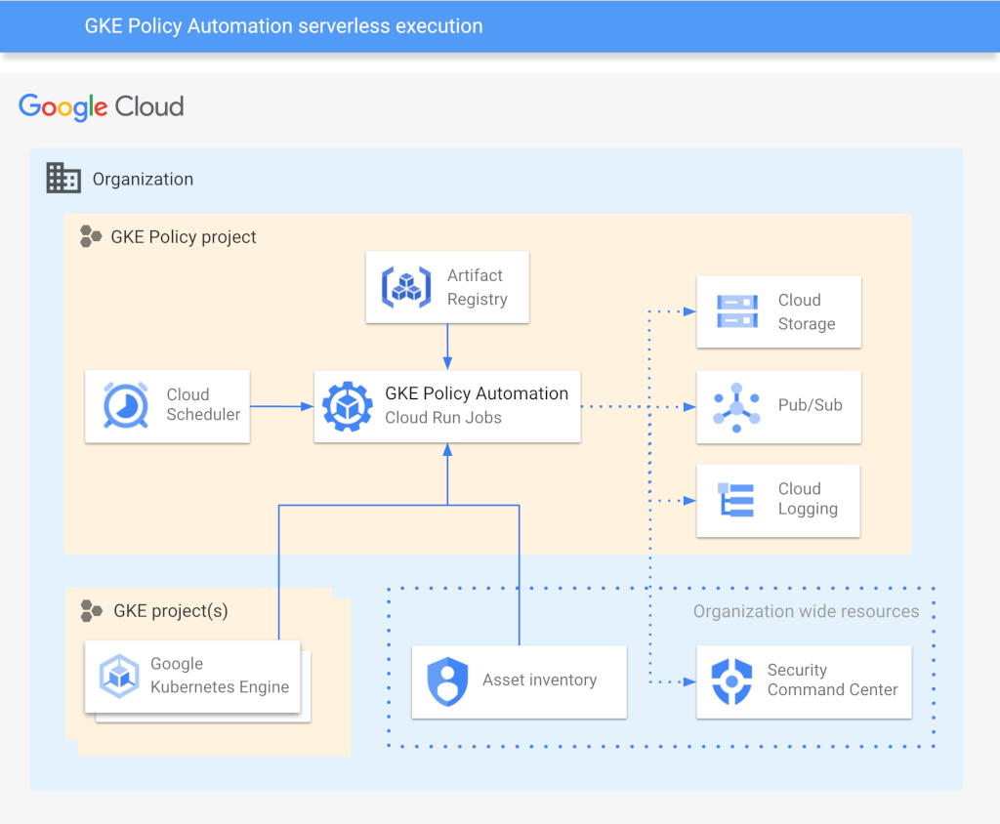

# GKE Policy Automation serverless deployment

A Terraform code for deploying GKE Policy Automation as an automatic serverless solution
on Google Cloud Platform.

The solution leverages the below GCP components:

* [Cloud Scheduler](https://cloud.google.com/scheduler)
  to trigger execution of a GKE Policy Automation tool in a periodic manner
* [Cloud Run Jobs](https://cloud.google.com/run/docs/create-jobs)
  to run containerized GKE Policy Automation tool
* [Artifact Registry](https://cloud.google.com/artifact-registry)
  to store GKE Policy Automation tool container image locally
* [Cloud Asset Inventory](https://cloud.google.com/asset-inventory/docs/overview)
  to discover GKE clusters in GCP organization, selected folders or projects
* Optionally, [Cloud Storage](https://cloud.google.com/storage),
  [Cloud Pub/Sub](https://cloud.google.com/pubsub), or
  [Security Command Center](https://cloud.google.com/security-command-center)
  as destinations for cluster evaluation results



---

## Prerequisites

* Terraform installed
* `gcloud` command
* Exiting project for GKE Policy Automation resources
* IAM permissions to create resources in the GKE Policy Automation project
* IAM permissions to create new IAM role bindings on projects, folders or organization levels
  *(depending on desired cluster discovery or outputs configuration)*

## Running

Provision infrastructure with Terraform:

1. Set Terraform configuration variables *(check [examples](#example-configurations)
   or [inputs](#inputs) below for details)*.

   Example `tfvars` file:

   ```hcl
   project_id = "gke-policy-123"
   region     = "europe-west2"

   discovery {
     enabled = true
     projects = ["gke-project-one", "gke-project-two"]
   }

   output_cloud_storage = {
     enabled         = true
     bucket_name     = "gke-validations"
     bucket_location = "EU"
   }
   ```

2. Adjust GKE Policy Automation's `config.yaml` accordingly
   *(check [User Guide](../docs/user-guide.md) for details)*.
3. Run `terraform init`
4. Run `terraform apply`

Push container image to Artifact Registry and create Cloud Run job:

1. Set environmental variables using env file generated by Terraform

   ```sh
   source ./cloudrun-config-env.sh
   ```

2. Automatic option: run `./cloudrun-config.sh` script

   NOTE: script can be also executed automatically by Terraform with local-exec by setting
   [run_script](variables.tf#L45) variable to `true`. In a such case, script also sets all
   required environmental variables.

3. Manual option: run below commands

   * Pull latest GKE Policy Automation container image

     ```sh
     docker pull ghcr.io/google/gke-policy-automation:latest
     ```

   * Authenticate to Artifact Registry

     ```sh
     gcloud auth print-access-token | docker login -u oauth2accesstoken --password-stdin https://${GKE_PA_REGION}-docker.pkg.dev
     ```

   * Tag GKE Policy automation container image

     ```sh
     docker tag ghcr.io/google/gke-policy-automation:latest ${GKE_PA_REGION}-docker.pkg.dev/${GKE_PA_PROJECT_ID}/gke-policy-automation/gke-policy-automation:latest
     ```

   * Push GKE Policy automation container image to Artifact Registry

     ```sh
     docker push ${GKE_PA_REGION}-docker.pkg.dev/${GKE_PA_PROJECT_ID}/gke-policy-automation/gke-policy-automation:latest
     ```

   * Create Cloud Run job

     ```sh
     gcloud beta run jobs create ${GKE_PA_JOB_NAME} \
       --image ${GKE_PA_REGION}-docker.pkg.dev/${GKE_PA_PROJECT_ID}/gke-policy-automation/gke-policy-automation:latest\
       --command=/gke-policy,check \
       --args=-c,/etc/secrets/config.yaml \
       --set-secrets /etc/secrets/config.yaml=${GKE_PA_SECRET_NAME}:latest \
       --service-account=${GKE_PA_SA_EMAIL} \
       --set-env-vars=GKE_POLICY_LOG=INFO \
       --region=${GKE_PA_REGION} \
       --project=${GKE_PA_PROJECT_ID}"
     ```

## What happens behind the scenes

The Terraform script within this folder enables all required APIs for you and creates necessary
service accounts and IAM bindings. Depending on configured cluster discovery options, corresponding
IAM bindings for GKE Policy Automation Service Account are created on projects, folders or
organization levels. The code also creates the Artifact Registry required by Cloud Run and
a the Secret Manager secret for storing tool's configuration file.

Depending on configured outputs, the code will provision corresponding resources and IAM role
bindings for Cloud Storage, Pub/Sub or Security COmmand Center.

Lastly, the script creates a Cloud Scheduler running once per day to trigger Cloud Run Job.

## Example configurations

* Cluster discovery on provided projects and Cloud Storage output

  ```hcl
  project_id = "gke-policy-123"
  region     = "europe-west2"

  discovery = {
    enabled      = true
    projects = [
      "gke-project-01",
      "gke-project-02"
    ]
  }

  output_cloud_storage = {
    enabled         = true
    bucket_name     = "gke-validations"
    bucket_location = "EU"
  }
  ```

* Cluster discovery on selected folders, Pub/Sub and Security Command Center outputs

  ```hcl
  project_id = "gke-policy-123"
  region     = "europe-west2"

  discovery = {
    enabled      = true
    folders = [
      "112316249356",
      "246836235717"
    ]
  }

  output_pubsub = {
    enabled = true
    topic   = "gke-validations"
  }

  output_scc = {
    enabled      = true
    organization = "123456789012"
  }
  ```

* Cluster discovery on the organization with a Security Command Center output

  ```hcl
  project_id = "gke-policy-123"
  region     = "europe-west2"

  discovery = {
    enabled      = true
    organization = "123456789012"
  }

  output_scc = {
    enabled      = true
    organization = "153963171798"
  }
  ```

## Inputs

| Name | Description | Type | Required | Default |
|---|---|:---:|:---:|:---:|
| [project_id](variables.tf#L17) | Identifier of an existing GCP project for GKE Policy Automation resources. | `string` | ✓ |  |
| [region](variables.tf#L22) | GCP region for GKE Policy Automation resources. | `string` | ✓ |  |
| [job_name](variables.tf#L27) | Name of a Cloud Run Job for GKE Policy Automation container. | `string` |  | `gke-policy-automation` |
| [config_file_path](variables.tf#L33) | Path to the YAML file with GKE Policy Automation configuration. | `string` |  | `config.yaml` |
| [config_file_path](variables.tf#L39) | CRON interval for triggering the GKE Policy Automation job. | `string` |  | `"0 1 * * *` |
| [run_script](variables.tf#L45) | Indicates whether to run script for populating Artifact Registry and Cloud Run Jobs. | `bool` |  | `false` |
| [discovery](variables.tf#L51) | Configuration of cluster discovery mechanism. Check [discovery attributes](#discovery-attributes).  | `map(any)` |  | `{"enabled" = true}` |
| [output_storage](variables.tf#L63) | Configuration of Cloud Storage output. Check [Cloud Storage attributes](#cloud-storage-attributes). | `map(any)` |  | `{"enabled" = false}` |
| [output_pubsub](variables.tf#L45) | Configuration of Pub/Sub output. Check [Pub/Sub attributes](#pubsub-attributes) | `map(any)` |  | `{"enabled" = false}` |
| [output_scc](variables.tf#L99) | Configuration of Security Command Center output. Check [Security Command Center attributes](#security-command-center-attributes). | `map(any)` |  | `{"enabled" = false}` |

### Discovery attributes

| Name | Description | Type | Required | Default |
|---|---|:---:|:---:|:---:|
| [enabled](variables.tf#L51) | Indicates if resources for discovery mechanism will be provisioned. | `bool` | ✓ |  |
| [organization](variables.tf#L51) | GCP region for GKE Policy Automation resources. *One of `organization`, `folders` or `projects` is required.* | `string` |  | `null` |
| [folders](variables.tf#L51) | List of folder numbers to provision discovery resources for. *One of `organization`, `folders` or `projects` is required.* | `bool` |  | `null` |
| [projects](variables.tf#L33) | List of project identifiers to provision discovery resources for. *One of `organization`, `folders` or `projects` is required.* | `string` |  | `null` |

### Cloud Storage attributes

| Name | Description | Type | Required | Default |
|---|---|:---:|:---:|:---:|
| [enabled](variables.tf#L63) | Indicates if resources for Cloud Storage output will be provisioned. | `bool` | ✓ |  |
| [bucket_name](variables.tf#L63) | The name of a bucket that will be provisioned. | `string` | ✓ |  |
| [bucket_location](variables.tf#L63) | The [location of a bucket](https://cloud.google.com/storage/docs/locations) that will be provisioned. | `string` | ✓ |  |

### Pub/Sub attributes

| Name | Description | Type | Required | Default |
|---|---|:---:|:---:|:---:|
| [enabled](variables.tf#L45) | Indicates if resources for Pub/Sub output will be provisioned. | `bool` | ✓ |  |
| [topic](variables.tf#L45) | The name of a topic that will be provisioned. | `bool` | ✓ |  |

### Security Command Center attributes

| Name | Description | Type | Required | Default |
|---|---|:---:|:---:|:---:|
| [enabled](variables.tf#L45) | Indicates if resources for Pub/Sub output will be provisioned. | `bool` | ✓ |  |
| [organization](variables.tf#L45) | The organization number to provision discovery resources for. | `string` | ✓ |  |
| [provision_source](variables.tf#L45) | Indicates weather to provision `roles/securitycenter.sourcesAdmin` for the tool, so it will be able to automatically register itself as a source. If not enabled, then this has to be done [manually beforehand](../docs/user-guide.md#security-command-center). | `bool` |  | `true` |

## Outputs

| name | description | sensitive |
|---|---|:---:|
| [sa_email](outputs.tf#L17) | GKE Policy Automation service account's email address. |  |
| [repository_id](outputs.tf#L22) | Identifier of a GKE Policy Automation repository. |  |
| [config_secret_id](outputs.tf#L27) | Identifier of a GKE Policy Automation configuration secret. |  |
| [env_variables_file](outputs.tf#L32) | File with environmental variables for Artifact Registry and Cloud Run configuration. |  |

## Troubleshooting

If your Cloud Run scheduler shows an error message before you have deployed your Cloud Run Job,
please ignore it. The scheduler cannot reach the job before it has been deployed. If the scheduler
still shows an error after you have deployed the job AND it has been triggered at least once
afterwards, then something is wrong.
